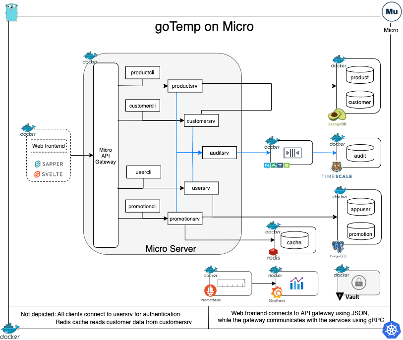
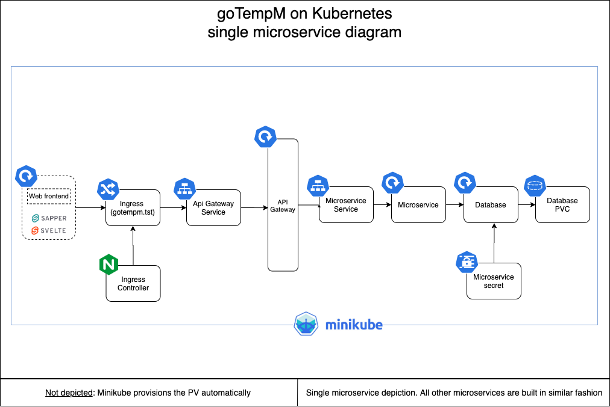

# goTempM
[](https://goreportcard.com/report/github.com/camba1/gotempm)


**goTempM** is a full stack Golang microservices sample application built on top of the Micro platform.
Note that the original goTemp, which is built directly on the go-Micro framework, is still available and can be found in the [goTemp repo](https://github.com/camba1/gotemp).
It is worth noting that Micro itself uses go-Micro as its underlying framework.

In it current incarnation (this is wip), this mono-repo uses the following stack as backend:

- `Golang` as its main implementation technology
- `Micro` as the microservices platform running our services
- `gRPC` for inter-service real time communication
- `NATS` for Pub/Sub event driven communication
- `multicast DNS` for service registration and discovery 
- `PostgreSql` for transactional data storage
- `TimescaleDB` time series DB used for historical audit data storage
- `ArangoDB`is a multi-model database used for master data storage
- `Redis` is used to cache data and reduce number of data requests to other services
- `Vault` for credentials management when running in Kubernetes

In terms of the web front end, the stack is as follows:

- `Javascript` as its main implementation technology
- `Svelte` is used as  the compilation engine (via rollup)
- `Sapper` is the javascript framework
- `Sveltestrap` provides the css framework and is based on bootstrap
- `Font Awesome` to display icons in the application

As far as observability, the application uses:

- `Prometheus` scrapes metrics from the microservices, databases and broker
- `Grafana` provides graphic visualization of application metrics

Finally, for orchestration, the stack is as follows:

- `Docker` for creating application images
- `Docker-compose` to run the application
- `Minikube` to run the application in Kubernetes

Below is a diagram that displays the overall setup of the application:



In a nutshell. the application functionality is as follows in the backend:

- The frontend connects to the different services through the Micro API gateway
- For each service the frontend provides:
    - Search page
    - Detail page
- Additionally, the frontend provides:
    - Landing page
    - Login page
    - Register page
- Each service performs the basic CRUD operations to their underlying databases
- All services authenticate via the user service
- All completed CUD operations are forwarded to the NATS broker which in turn forwards the message to the auditing service. This service saves the data into TimescaleDB.
- Each service has a client which can be used to test all basic CRUD functionality


### Starting the application

**Note:** At this time, starting multiple services in a row (which the startup scripts do) sometimes causes an error to be thrown. The details of the issue are described in [issue 8](https://github.com/camba1/gotempm/issues/8).
As such, portions of the startup scripts may have to be re-run manually to bring the application up fully.


Before running the application the first time:

- Clone the repository
- cd into `gotempM/web/sapper`
- Run the following command to generate the javascript dependencies.

```bash
    npm install
```
#### Running with the Micro Docker image

##### Prerequisites

###### Software
- [Docker](https://www.docker.com/get-started)  must be installed and running

#### Running the app

To start the application:

- Ensure that Docker is installed and running. Then, execute the following command from a terminal in the goTempM root folder:

```bash
   make microup
```

Depending on whether you have run the application before, docker may have to download all the dependent images (Micro, PostgreSql, TimescaleDB, Nodejs, etc).
This may take a while depending on your internet connection speed. Once everything has been downloaded and started, you should see a message in the terminal indicating that the application is listening at localhost:3000.
At that point, yo can open your browser and navigate to:
```
    http://localhost:3000
``` 

Additionally, observability tooling can be accessed at the addresses below 

```
    Prometheus:  http://localhost:9090
    Grafana:     http://localhost:3001
```

To stop the application:

```bash
    make microdown
```

#### Running on Kubernetes (Minikube) using the Micro Helm chart


##### Prerequisites

###### Software

- Ensure [Micro](https://micro.mu/getting-started) is installed on the host
- [Docker](https://www.docker.com/get-started)  must be installed and running
- Ensure that [Minikube](https://minikube.sigs.k8s.io/docs/) is installed and running
- Similarly, ensure that [Helm](https://helm.sh) is installed on the host.
- Install the [Micro Helm Chart](https://artifacthub.io/packages/helm/micro/micro)

###### Ingress

The application front end connects with the API gateway using via a K8s ingress resource. As such, the ingress addon must be
enabled in Minikube.  To enabled it, run:

```bash
    minikube addons enable ingress
```
Check the ingress is working using the command below. The command's results should include an entry for the ingress.

```bash
    kubectl get pods -n kube-system
```


##### Building and pushing images (optional)


Out of the box, the Kubernetes manifest will pull existing Bolbeck goTemp images for the front end and some of the DBs from Docker Hub.
You are welcome to change the Kubernetes manifests in the `./cicd/K8s` folder to pull your own images.
To build your own image of the front end and push it to docker hub run the command below for each of the services:

```bash
    make hubpushcontext SERVICE=web FOLDER=web
```

where serviceName is the name of the service for which the image should be built
folderName is the folder that contains the docker file used to build the service image

Note that Micro will automagically create and deploy the containers for the different services

##### Running

Enable Port forwarding:
```bash
    kubectl port-forward svc/proxy -n micro 8081:443
```
Note that the application itself does not need this port forwarding, this is only needed so that we can send commands to Micro and start the app.

Start application by running:
```bash
    make microk8sup
```

Once the application is deployed, check the address and host assigned to the ingress:

```bash
    kubectl get ingress -n micro
```

Note that it takes a couple of minutes for K8s to assign the IP to the ingress. As such wait for that happens before moving ahead.

If this is the first time running the app in Minikube: Grab the address & the host from the
result of the command above, and add it to your `/etc/hosts` file.

Finally, access app:
```
     minikube service web -n micro
```


##### Vault integration

The microservices can be integrated with Vault when running in K8s to manage their credentials.
To enable this integration, please first **refer to the README in the** `./vault` **directory** to setup Vault and all the microservices secrets.
Once that is configured, and the application is running, just execute :

```bash
    make vkubpatchdeploy
```

Once that completes, the microservices' credentials to the different dependencies (DBs, brokers,etc ...) can be managed in Vault.

##### Stopping the application

to stop the application, execute:

```bash
    make microK8sdown
```

Note: The port forwarding to Micro should also be stopped.
Also, if the Vault Integration is enabled, and the VAULT UI is enabled, then the associated port-forwarding should be stopped as well. 


#### Running with Micro locally

#### Prerequisites

###### Software

- Ensure [Micro](https://micro.mu/getting-started) is installed
- [Docker](https://www.docker.com/get-started)  must be installed and running

#### Running

Start the micro server:
```bash
    micro server
```
Wait for the server to be up and ensure that you can access localhost:8080 before continuing to next step.
Start the application:
```bash
    make microlocalup
```

Access the application in your browser at:
```
    http://localhost:3000
``` 

To stop the application, run:
```bash
    make microlocaldown
```

### Repo organization

The project is organized in a way that each folder represents either a service, a database or a shared library package.
Currently, we have the following:

- `arangodb`: Volumes mounted to the ArangoDB container as well as data initialization scripts
- `audit`: Audit service to collect and store historical audit information
- `cicd` : Holds files related to CI/CD and orchestration
- `customer`: Customer master data service
- `diagramforDocs`: Diagrams used in the readme documents
- `globalCache` : Enables Micro to use Redis as a cache store which can then be used in our services
- `globalErrors`: Generic errors shared package
- `globalMonitoring`: Generic monitoring utilities shared package
- `globalProtos`: Generic protobuf message definitions shared across packages
- `globalUtils`: Generic utilities shared package
- `grafana`: Grafana configuration and custom dashboard definitions
- `micro` : Hosts the custom Dockerfile that is used to run Micro.
- `nats`: NATS dockerfile and configuration
- `postgres`: Volumes mounted to the PostgreSQL DB container as well as data initialization scripts
- `product`: Product master data service
- `promotion`: Promotion service to track product discounts (this was the first service built)
- `prometheus`: Prometheus configuration and exporters
- `redis`: Volumes mounted on the redis container as well as config files (if any)
- `timescaleDB`: Volumes mounted to the Timescale DB container as well as data initialization scripts
- `user`: User and authentication service
- `Vault`: Scripts & policies needed to run the app in K8s with Vault
- `web`: application web frontend

Additionally, we have the following files in the root directory as well:

- `.dockerignore`: Files to be ignored when building service images
- `.gitignore`: Files to be ignored by git
- `docker-compose`: File controls the building of the different services and their dependencies
- `go.mod and go.sum`: Go modules control
- `main.go`: Not used for services yet
- `Makefile`: shortcuts to common actions
- `Readme.md`: Well... this file...

### Services

We use `Micro` as the main GO microservices platform. Using Micro simplifies many of the tasks associated with building 
microservices including (but not limited to):

- Service discovery
- gRPC for inter service communication
- Built in async messaging (in our case used to set up pub/sub messages to NATS )
- Built-in data storage interface (in our case used to interact with Redis)
- API gateway:
     - Request routing
     - Load balancing
     - Automatic conversion of frontend JSON payloads to backend gRPC messages 


##### Organization

Each one of the services has a similar structure:

- `client`: Contains a client service that calls the server service to perform multiple operations
- `proto`: Proto buffer messages and services definitions. Empty if service does not handle real time inter-service communication.
- `server`: Service that performs a number of actions like interacting with the DB
- `Dockerfile`: Build the image for the server service
- `DockerfileCLI`: Build the image of the client service
- `docker-compose.env`: Environment variable required to run the service when running the service with docker-compose
- `docker-compose-cli.env`: Environment variable required to run the client when running the client with docker-compose

##### Running individual services

###### Starting the service

The services must be started using Micro run. Since we are using the Dockerized version of Micro, we can start a service as follows:

If Micro is not already running:

`make microserveup`

This will start Micro as well as all the DBs used by goTempM.
Get into the Micro container, if not in it already:

`docker exec -it microservercont bash`

Start the service:

`make micro<serviceName>`

where <serviceName> can be usersrv, auditsrv, customersrv, productsrv or promotionsrv.

###### Testing the service

_Note: all the commands below must be run within the Micro container_

To run some data through a service once it is started, we can run the service client:

`micro run --name <serviceClientName> <serviceFolder>/client`

where <serviceClientName> can be usercli, auditcli, customercli, productcli or promotioncli.
For example, we could start the user client as follows:

`micro run --name usercli user/client`

This will bring up run the client service which will attempt to create,update and delete a user. 
The results will be printed to the log. To see the logs, run:

`micro logs -f <serviceOrClientName>`

The server user service will update the DB as necessary and send the updated information to the broker (NATS) so that 
the audit service may eventually store it in the time series DB. The audit service can be started using:

`make microauditsrv`

#### Databases Initialization

The project initializes each of the DBs and seeds them with tables and data. Data changes made at run time are automatically persisted using mounted volumes when running via docker-compose. 
See the folders for each DB for details as well as the docker-compose file.

### Web front end

Our web front end is built with Svelte and Sapper which have some interesting benefits:

- Server-side initial rendering of our pages
- File based routing
- Smaller code base than other Javascript frameworks. Does more with less.
- Svelte translates the code to vanilla javascript. Thus, smaller application footprint than most frameworks
- Emphasis on component re-usability

##### Organization

The web application lives in the `./web` folder. Since `Sapper` and `Svelte` generate multiple files and folders, we will just discuss the relevant folders below:

- `sapper`: The main folder containing the web app
    - `src`: This is where the bulk of the application resides
        - `components`: Contains re-usable `Svelte` components
        - `globalUtils`: Shared javascript utilities
        - `routes`: application routes to the different pages
        - `client.js`: This is a required file. It is used to start `Sapper`.
        - `server.js`: Used to configure the app with items like middleware and compression
        - `template.html`: Main page that contains our application. We added Bootstrap and Font Awesome CDN references in this page.
    - `static`: Holds static items
- `Dockerfile`: Used to build the docker image for the web app
        
#### Routes

All of our main routes are pretty standard in terms of organization. We will use the customer route (`./web/sapper/src/routes/customer`) as an example:

- `index.svelte`: Main customers search page that serves at localhost:3000/customer
- `_searchGridSlot`: Component holds the template for the search grid to be display in hte search page (index.svelte)
- `new.svelte`: Page to be displayed when user want to create a new customer. Displayed at localhost:3000/customer/new .
- `[slug].svelte`: Page to view and modify existing customers. Displayed at localhost:3000/customer/[customerid]
- `_detail.svelte`: Holds the gui and bulk of the logic for adding or editing customers. It is called by new.svelte and [slug].svelte .

There are three routes that do not share the structure above as they have very little functionality and thus are server by a single index.svelte component: root, register and login.

### Kubernetes

The application configuration in K8s can be seen in the diagram below. Note that the diagram shows just one of the different microservices and its associated database.
The configuration for all other microservices, beyond the shared ingress and API Gateway, is similar to the one depicted in the diagram. Note that Micro builds and spins out the service pods.




#### Organization

The K8s files live in the `./cicd/K8s` folder, and is organized as follows:

- `dbsAndBroker`: Contains the manifests for all the databases and for the broker.
- `Ingress`: Manifest to create the ingress resource that allows the frontend, and the back end to communicate
- `microservicesPatch`: contains the manifests to open the ports required to scrape metrics from the microservices
- `monitoring`: holds the manifests to deploy monitoring resources (Prometheus, Grafana)
- `Vault`: Manifests to create the service accounts and patches to integrate the application with Vault
- `web`: Manifest for the web front end.

Note that within each of the folders, most related manifests are organized  using a prefix.
For example, all the front end related services start with the 'web' prefix.

### Additional information:

Additional information can be found in the individual folders either in a `readme.md` or a `doc.go` file.
Additionally, the Makefile contains many command samples that can be used for development.  
