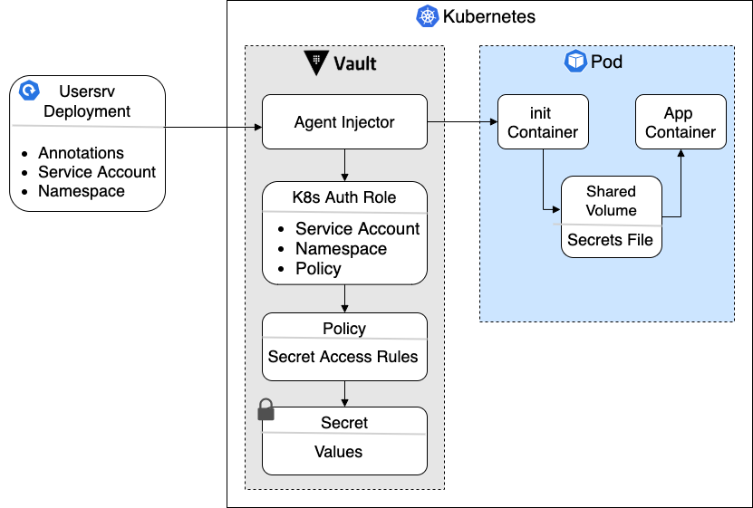

# Integrating services with Vault

The application services can be integrated with Vault when running in Kubernetes. The integration takes advantage of the Vault Agent Injector to create init containers that populate the necessary secrets in the services containers.
This allows the integration to take place with no changes to the existing code base.

To enable the integration, there are two things that have to happen:
- Vault needs to be configured with the necessary secrets/policies/roles for our services
- The Kubernetes YAML manifests for our services deployments must be patched to interact with Vault's agent injector





### Setting up Vault

#### Prerequisites

- Ensure [Helm](https://helm.sh/docs/intro/install/) is installed and that it has access to the K8s cluster
- Install the [Vault Helm chart](https://www.vaultproject.io/docs/platform/k8s/helm/run#standalone-mode) in the cluster.
  While you can install Vault with different backends, for our purposes it is enough to install it in 'standalone' mode which will set up a file storage backend. The Agent injector is installed alongside Vault by the Helm chart.
- Initialize and unseal Vault

#### Access the Vault UI (optional)

To access the Vault UI, set up a port forward to port 8200 in the Vault container:
```bash
  kubectl port-forward --namespace vault vault-0 8200:8200
```
If the port is busy or returns an error when trying to access the UI in localhost:8200,  try a different port like `8100:8200` or let the host assign the port using  `:8200`

#### Setup secrets in Vault

##### Scripts and policies

The current directory (`/vault`) is organized as follows:
- `policies` contains the policies that need to be created in Vault to provide access to our services' credentials
- `scripts` contains the scripts that create all the required secrets, policies and roles in Vault

##### Setup

<u>Note:</u> The commands below assume that Vault was installed using the default name. Thus, it assumes that the Vault container is called `vault-0`. If that is not the case, you may need to modify the Makefile with the appropriate container name.
Additionally, the scripts need a Vault token in order to authenticate properly. You may use your
root token (not really recommended). Alternatively, you can create and provide your own token.

Initialize the Vault secrets engine and the Kubernetes authentication method by running:

```bash
    make vkubinit VAULT_TOKEN=<yourVaultToken>
```

Create the secrets and roles needed to populate the credentials for our services

```bash
    make vkubsetup VAULT_TOKEN=<yourVaultToken>
```

### Patching the services' deployment manifests

The `/cicd/K8s/vault` directory contains the necessary manifests to patch our service deployments to set up interaction with Vault.

The folder has the following structure:

- `patch` contains the patches for each one of our service deployments.
- `serviceAccount` has the manifests that create the service accounts to be associated with our services.
- `testYamlFile` provides copies of the manifests for each of the services with the relevant secrets commented out. These manifests are used to test that the secrets are being properly populated by Vault.


To create the service account and apply the patches, run:
```bash
    make vkubpatchdeploy
```

Once the command completes, the services will be integrated with Vault. At this point, the credentials of the services can be managed centrally in Vault.

### Validating Integration

To validate that integration was successful after patching the deployments, you can check the following things:

- All services' pods are running 
- Describe a service pod (kubectl describe) and ensure a Vault-agent-init was created and started
- Login into a service pod (kubectl exec) and check that there are files under /vault/secrets.
- The front end can pull and display data normally from the different services

### Testing the integration

We will test the integration for the user service, but a similar process can be done for any of the services:
- Login to PostgreSQL and ensure you are in the appuser DB 
- Change the appuser database password
  
```postgresql
  ALTER USER postgres WITH PASSWORD 'superPWD2021';
```

- In Vault, create a new version of the secret that keeps the postgresDB credentials for the user service (in the following secret engine: gotempmkv -> database -> postgresql -> usersrv).
  Make sure you update the password in the new secret version to match the new passowrd of the appuser DB
- Restart the rollout of the user service deployment
  
```bash
  kubectl rollout restart deployment user-latest -n micro
```
- In the web front end, try to log in to the application and pull some data for the user service

### Redeploying

One important aspect of this integration is that it does not change any of the existing code of YAML for the services by using K8s patches.
While this is great, there are one caveat:

- Whenever changes are pushed to any of the services the associated patch must be applied as well


